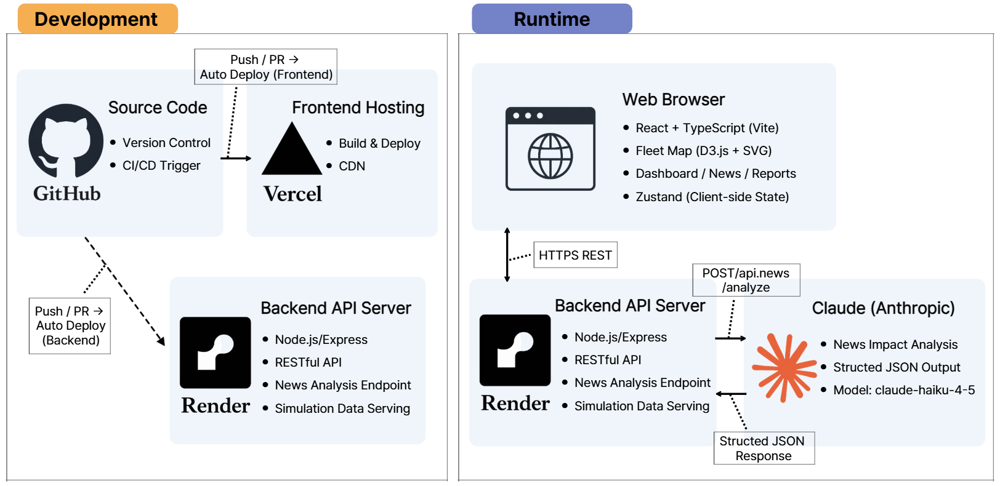

# GLOVIS PACE

목적항 파업·태풍·장비고장·항만혼잡 발생 시 자사선 감속/증속 옵션별 연료비·대기시간·CO2·후속일정
영향을 계산해 운항 담당자의 승인·실행·리포트 작성을 지원하는 운항 의사결정 지원 대시보드다.

뉴스 기사와 RTA(Revised Time of Arrival) 통보문을 backend가 Claude(Anthropic API)로 분석해
사건을 감지하고, 프런트엔드의 결정론적 계산 엔진이 속도 옵션·연료비·CO2·일정 영향을 계산한다.
가상 시뮬레이션 시계("다음 이벤트" 버튼)로 시간을 진행시키며 뉴스 접수 → 잠정 판단 승인 →
RTA 확정 → 실행 → 리포트까지 전체 흐름을 시연할 수 있다.

## 핵심 기능

- 사이드바 + 라우팅 기반 화면 구조(대시보드/지도/뉴스/운항 판단/리포트가 각각 독립 URL)
- 세계지도 기반 선대 지도(D3 렌더러) — 97척 시뮬레이션 배경 선대 + GLOVIS A~E 5척은 시뮬레이션
  시계에 따라 실제 항로를 따라 이동
- 시뮬레이션 시계가 재생하는 뉴스/RTA 이벤트를 backend가 Claude로 분석 → 4옵션(현재 속도 유지 /
  소폭 감속 / 표준 감속 / 최대 감속) 계산 → 승인 → RTA 확정 → 실행까지 이어지는 판단 흐름
  (`/decisions/incident/:incidentId`)
- 판단 대기열은 앱 시작 시 비어 있으며, 시뮬레이션 이벤트로 뉴스가 접수되어야 채워진다(고정 Mock 없음)
- 속도 옵션 계산(연료비·CO2·접안 대기·일정 영향), 승인 및 실행 흐름
- 완료된 판단을 자동으로 리포트 이력에 기록하고, 3페이지 PDF(사건·AI 판단 / 계산식·경제효과 /
  전후 비교 통계)로 내보내는 `/reports`
- Zustand 기반 상태관리(시뮬레이션 시계/판단 세션/판단 대기열/뉴스/실행 기록/리포트 이력)

## 아키텍처



- **Development**: GitHub에 push/PR하면 Vercel(frontend)과 Render(backend)가 각각 자동 빌드·배포한다.
- **Runtime**: 브라우저(React + Zustand)가 HTTPS REST로 backend(Node.js/Express)를 호출하고,
  backend는 뉴스 분석 요청(`POST /api/news/analyze`)만 Claude(Anthropic, `claude-haiku-4-5`)에
  전달해 구조화된 JSON을 받는다. 계산(연료비·CO2·일정 영향)은 항상 프런트엔드가 담당한다.

## 프로젝트 구조

```
GLOVIS-PACE/
├─ frontend/   React 19 + Vite + TypeScript + Tailwind v4 — GLOVIS PACE 대시보드/지도/판단/리포트
├─ backend/    Node.js + TypeScript + Express — Claude 기반 뉴스/RTA 분석 API
├─ docs/       설계·구조 문서
├─ package.json
└─ README.md
```

자세한 폴더 구조는 [`docs/project-structure.md`](docs/project-structure.md) 참고.

## 화면 구성

| 경로 | 화면 | 설명 |
| --- | --- | --- |
| `/dashboard` | 대시보드 | 진입 기본 화면. KPI, 최근 움직임, 최근 경보, 최근 결정(전부 실데이터 계산, 초기엔 빈 상태) |
| `/map` | 선대 지도 | 97척 시뮬레이션 선대를 전체화면 지도에 표시, GLOVIS A~E는 시뮬레이션 시계에 따라 이동 |
| `/news` | 뉴스 | 접수된 뉴스와 AI 처리 상태 목록(백엔드 미연동 시 빈 상태) |
| `/decisions` | 운항 판단 | 판단이 필요한 사건 대기열 + 승인된 판단의 실행 진행 상태 |
| `/decisions/incident/:incidentId` | 운항 판단 상세 | 뉴스 분석 → 4옵션 계산 → 승인 → RTA 확정 |
| `/reports` | 리포트 | 완료된 판단 이력 목록 + 3페이지 PDF 내보내기 |

## 설치

```bash
npm install
npm --prefix frontend install
npm --prefix backend install
```

## 실행 방법

```bash
npm run dev
```

프런트(`http://localhost:5173`)와 백엔드(`http://localhost:4000`)가 동시에 실행된다(`concurrently`).
개별 실행도 가능하다.

```bash
npm run dev:frontend
npm run dev:backend
```

## frontend 환경변수

`frontend/.env.example` 참고.

```
VITE_API_BASE_URL=http://localhost:4000   # backend 주소. 뉴스/RTA 분석 요청을 여기로 보낸다.
```

## backend 환경변수

`backend/.env.example` 참고. 실제 값은 `backend/.env`에 직접 입력한다(`.gitignore`로 제외됨).
API 키는 반드시 backend에서만 사용하고 프런트엔드로 전달하지 않는다.

```
PORT=4000
FRONTEND_ORIGIN=http://localhost:5173

ANTHROPIC_API_KEY=            # 필수. 비워두면 /api/news/analyze, /api/rta/analyze가 500을 반환한다.
ANTHROPIC_MODEL=claude-haiku-4-5   # 분류·추출 작업이라 빠르고 저렴한 티어로 충분
ANTHROPIC_TIMEOUT_MS=12000
```

## 주요 REST API

| Method | Path | 설명 |
| --- | --- | --- |
| GET | `/api/health` | 서버 헬스체크 |
| POST | `/api/news/analyze` | 뉴스 기사(title/content/publishedAt 등)를 Claude로 분석해 구조화된 사건 정보 반환 |
| POST | `/api/rta/analyze` | RTA 통보문(text)을 Claude로 분석해 구조화된 구간·지연 정보 반환 |

## 시연 방법

1. `npm run dev`로 프런트/백엔드를 함께 실행한다. `backend/.env`에 `ANTHROPIC_API_KEY`를 설정한다.
2. `/dashboard`에 진입한다 — KPI는 97척 선대 기준으로 바로 계산되지만, 판단 대기열·최근 경보·최근
   결정은 아직 아무것도 없는 빈 상태다(고정 Mock이 없기 때문).
3. `/map`에서 97척 전체 선대와 GLOVIS A~E의 위치를 확인한다. 상단 시뮬레이션 시계 바의
   "다음 이벤트"를 누르면 가상 시계가 다음 이벤트 시각으로 진행하고 선박이 이동한다.
4. "다음 이벤트"를 계속 누르면 시뮬레이션 시계가 뉴스 이벤트 시각에 도달했을 때 backend가 Claude로
   해당 뉴스를 자동 분석해 영향 항만·사건 유형·예상 지연을 추출하고, 영향받는 GLOVIS 선박이 있으면
   판단 대기열에 사건이 생성된다.
5. `/decisions`에서 방금 생성된 사건을 확인하고 클릭 → 상세 화면에서 4옵션(현재 속도 유지 / 소폭
   감속 / 표준 감속 / 최대 감속) 중 하나를 검토 후 승인한다.
6. "다음 이벤트"를 계속 눌러 RTA 통보 시각까지 진행하면, 확정 판단 화면에서 뉴스 추정치와 RTA
   확정치를 비교해 재확정한다.
7. `/decisions`에서 "다음 실행 단계"를 눌러 승인된 판단을 DRAFT → APPROVED → EXECUTING →
   MONITORING → COMPLETED까지 진행시킨다.
8. 판단이 COMPLETED되면 `/reports`에 자동으로 기록된다. 개별 판단을 열어 3페이지 PDF(사건·AI 판단
   /계산식·경제효과 상세/전후 비교 통계)로 내보낼 수 있다.

## 테스트 / 검증

```bash
npm run typecheck  # 백엔드 tsc --noEmit + 프런트 tsc -b
npm run lint        # 백엔드 + 프런트 oxlint
npm run test         # 백엔드 vitest + 프런트 vitest
npm run build        # 백엔드 tsc build + 프런트 tsc+vite build
```

## 현재 제한사항

- `backend/`는 뉴스/RTA 분석 전용 API이며, 선박 위치를 위한 실시간 AIS 연동은 없다. 지도의 97척
  배경 선대와 GLOVIS A~E 위치는 모두 결정론적 시뮬레이션 데이터다.
- 계산(연료비·CO2·일정 영향)은 항상 프런트엔드의 순수 함수가 담당한다. Claude는 뉴스/RTA 문서에서
  구조화된 사실(항만·사건 유형·지연 추정치)을 추출할 뿐 계산에는 관여하지 않는다.

## 설계 문서

- [`docs/GLOVIS_PACE_프로젝트_이해_현재구현기준.md`](docs/GLOVIS_PACE_프로젝트_이해_현재구현기준.md) — 문제 정의, 핵심 사용자, 판단 카드 설계 의도
- [`docs/dashboard-plan.md`](docs/dashboard-plan.md) — 현재 화면·컴포넌트·상태·계산 모듈 구조
- [`docs/project-structure.md`](docs/project-structure.md) — 현재 frontend/backend 폴더 구조
- [`docs/GLOVIS_PACE_v7_통합_구현명세_Claude_Code.md`](docs/GLOVIS_PACE_v7_통합_구현명세_Claude_Code.md) — 뉴스/RTA 시나리오·계산 공식·타임라인 상세 스펙
- [`docs/Claude_Code_뉴스_RTA_원문_입력.md`](docs/Claude_Code_뉴스_RTA_원문_입력.md) — 데모 시나리오 뉴스/RTA 원문 fixture
